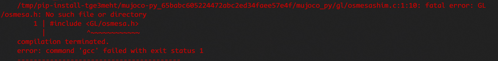
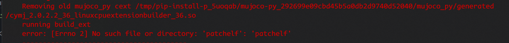

# README

This is my implemention of the CS285 DRL homework and problems I met.

## 实现思路

实现思路就是按照Dagger算法的四个步骤，需要注意的是training过程中一直使用的是collect policy

> 使用collect policy生成一组sequence  
> 用expert policy对这次收集到的sequence做relabel，就是重新为每一步的state附上新的action  
> 然后将这段sequence加入到replace buffer中  
> 最后随机从replace buffer中sample出training data  

在`rl_trainer.py` 106-124

```python
 # collect trajectories, to be used for training
            training_returns = self.collect_training_trajectories(
                itr,
                initial_expertdata,
                collect_policy,
                self.params['batch_size']
            )  # HW1: implement this function below
            paths, envsteps_this_batch, train_video_paths = training_returns
            self.total_envsteps += envsteps_this_batch

            # relabel the collected obs with actions from a provided expert policy
            if relabel_with_expert and itr>=start_relabel_with_expert:
                paths = self.do_relabel_with_expert(expert_policy, paths)  # HW1: implement this function below

            # add collected data to replay buffer
            self.agent.add_to_replay_buffer(paths)

            # train agent (using sampled data from replay buffer)
            training_logs = self.train_agent()  # HW1: implement this function below
```

## 结果分析

## 遇到的问题

1. starter code中`rl_trainer.py`文件中的`MAX_VIDEO_LEN`需要改为global
    当时遇到的问题是不论怎么设置，保存下来的humanoid的可视化的图都只有很短的前面一小部分的图。后来发现每次图片就保存了40帧，
    在`rl_trainer.py`中的`MAX_VIDEO_LEN`是一个全局变量，在进入__init__代码块之后我们需要修改这个全局变量，所以要加上global

2. 配置mujuco环境
   
   1. roboti.us 使用http,不是https  
      `wget http://www.roboti.us/file/mjkey.txt`
      
      2. | #include <GL/osmesa.h>
             
         
         > `sudo apt install libosmesa6-dev`
      
      3. error: [Errno 2] No such file or directory: 'patchelf': 'patchelf'
         
         
         > `sudo apt-get install patchelf`

## 收获

学习replace buffer的代码实现

# 